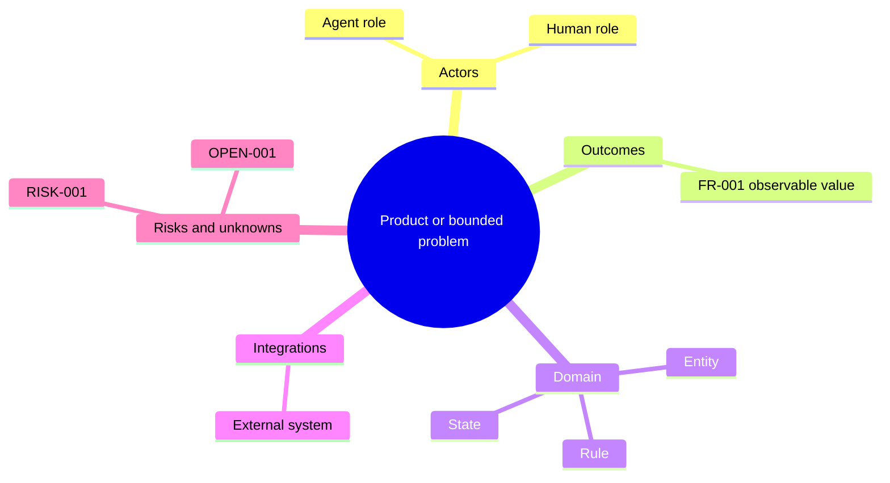
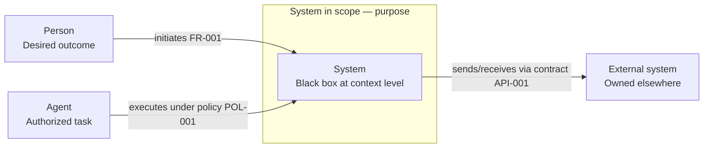
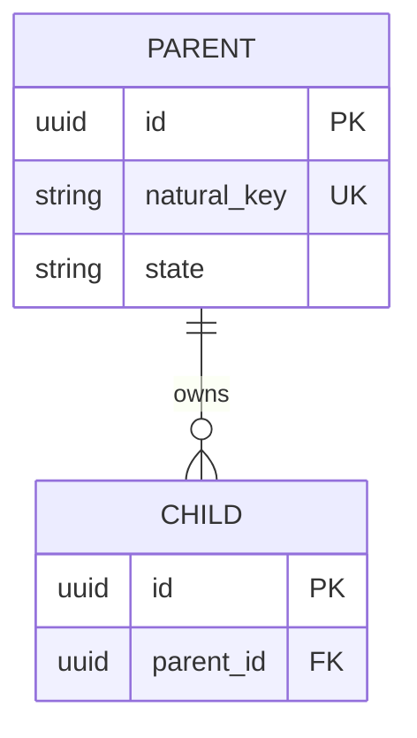
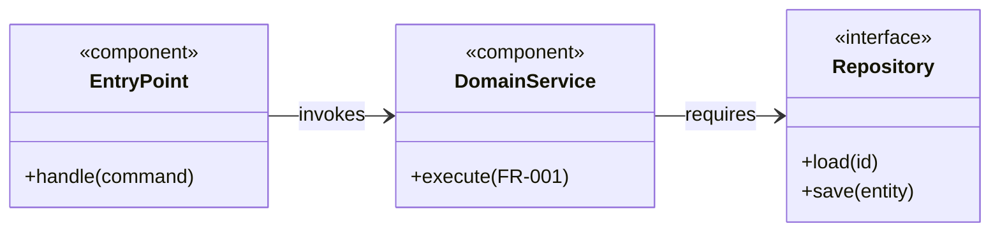
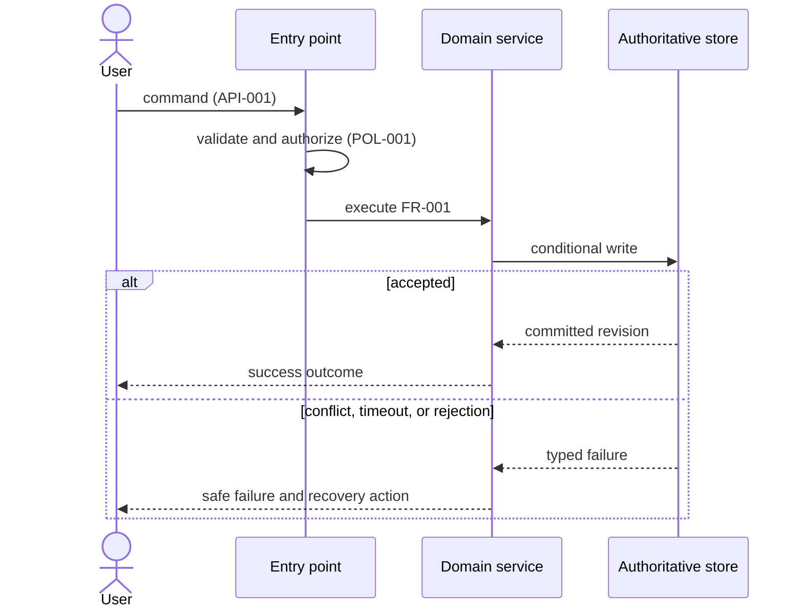
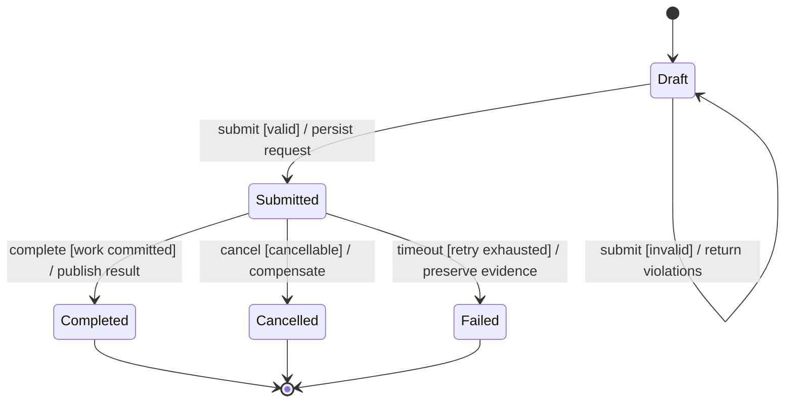
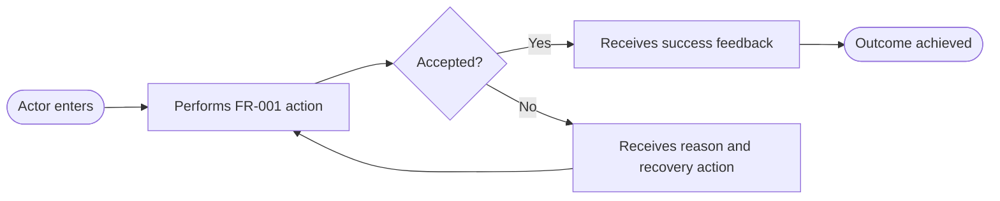

# PRD and TD visual template

Copy only the sections that apply, but retain the diagram manifest and account for
every core diagram family as `present` or `N/A` under the
[PRD and TD visual documentation contract](prd-td-visual-contract.md).

## Document control

| Field | Value |
| --- | --- |
| Document ID | `PRD-...` or `TD-...` |
| Title |  |
| Status | draft / proposed / approved / superseded |
| Owner |  |
| Source or revision | issue, brief, commit, or document revision |
| Updated | YYYY-MM-DD |
| Scope |  |
| Supersedes | `N/A` or document ID |

## Human review layer

### Problem, actors, and outcome

- Problem and current evidence:
- Human/Agent actors:
- Desired observable outcome:
- Why now:

### Scope and decision

- In scope:
- Non-goals:
- Hard constraints:
- Selected direction and why:
- Material alternative and rejection reason:
- Top risks, assumptions, and open decisions:

## Agent execution contract

### Requirements

| ID | Actor | Trigger/preconditions | Behavior | Inputs/outputs | Success | Failure/recovery | Invariants | Acceptance/evidence |
| --- | --- | --- | --- | --- | --- | --- | --- | --- |
| `FR-001` |  |  |  |  |  |  |  |  |

### Quality requirements

| ID | Attribute | Workload and threshold | Measurement | Design consequence |
| --- | --- | --- | --- | --- |
| `NFR-001` | reliability / latency / security / cost / ... |  |  |  |

### Authoritative contracts

| Contract ID | Type | Location/revision | Producer/owner | Consumers | Compatibility rule |
| --- | --- | --- | --- | --- | --- |
| `API-001` | OpenAPI / AsyncAPI / schema / migration / policy |  |  |  |  |

## Diagram manifest

| ID | Type | Coverage | Question answered | Scope/viewpoint | Audience | Requirement/ADR IDs | Source | Status/revision |
| --- | --- | --- | --- | --- | --- | --- | --- | --- |
| `D-01` | concept mind map | present | What concepts must stay distinct? | product/domain | human + Agent |  | inline Mermaid |  |
| `D-02` | system context | present | Who interacts with the system and what is outside it? | target system | human + Agent |  | inline Mermaid |  |
| `D-03` | ER | present or `N/A: reason` | What entities, ownership, and cardinalities exist? | conceptual/logical/physical | human + Agent |  | inline Mermaid |  |
| `D-04` | component/class | present or `N/A: reason` | Which components own behavior and dependencies? | functional/container/component/code | human + Agent |  | inline Mermaid |  |
| `D-05` | sequence | present or `N/A: reason` | How does a named scenario succeed or fail over time? | named scenario | human + Agent |  | inline Mermaid |  |
| `D-06` | state machine | present or `N/A: reason` | Which lifecycle transitions are allowed? | named object/workflow | human + Agent |  | inline Mermaid |  |
| `D-07` | user journey/activity | present or `N/A: reason` | How does an actor reach value and recover? | named actor and outcome | human + Agent |  | inline Mermaid |  |

Add conditional deployment/network, data-flow/trust, identity/access,
availability/resilience, or requirement-trace views when their trigger exists.

## Visuals

Replace labels with domain terms and stable IDs. These are semantic skeletons,
not a sample solution.

### D-01 — Concept mind map

Question: What concepts must reviewers and implementers keep distinct?

Figure D-01. Concept decomposition; leaves link to formal definitions below.

### D-02 — System context

Question: Who interacts with the system, and what is outside its boundary?

Figure D-02. System context and external interaction purposes.

### D-03 — ER diagram

Question: What are the authoritative entities and their cardinalities?

Figure D-03. Logical or physical data model; label the level in the narrative.

### D-04 — Component/class diagram

Question: Which components own the behavior and how may they depend on each other?

Figure D-04. One component abstraction level with responsibilities and directed
dependencies.

### D-05 — Sequence diagram

Question: How does the critical scenario succeed or fail over time?

Figure D-05. Critical success and material failure behavior.

### D-06 — State machine

Question: What lifecycle transitions are allowed for the core object?

Figure D-06. Core lifecycle using `event [guard] / effect` transitions.

### D-07 — User journey or activity flow

Question: How does the actor reach value and recover from a blocked path?

Figure D-07. Actor journey, feedback, and recovery.

## Decisions and risks

| ADR/Risk ID | Context or trigger | Options/impact | Decision/response | Status/owner | Recheck or supersession condition |
| --- | --- | --- | --- | --- | --- |
| `ADR-001` |  |  |  | proposed |  |
| `RISK-001` |  |  |  | open |  |

## Traceability and delivery

| Outcome/source | Requirement | Figures/contracts/ADR | Work package | Verification | Status |
| --- | --- | --- | --- | --- | --- |
|  | `FR-001` | `D-02`, `D-05`, `API-001` |  |  | planned |

### Rollout, rollback, and operations

- Migration and compatibility:
- Rollout stages and abort signals:
- Rollback or replacement seam:
- Observability and alert evidence:
- Security/privacy/data handling:

### Review evidence

- Renderer and version:
- Rendered figures visually inspected:
- Contract/schema validation:
- Human comprehension reviewer and result:
- Agent precision/self-check or evaluation and result:
- Not run, unknown, stale, or blocked evidence:
