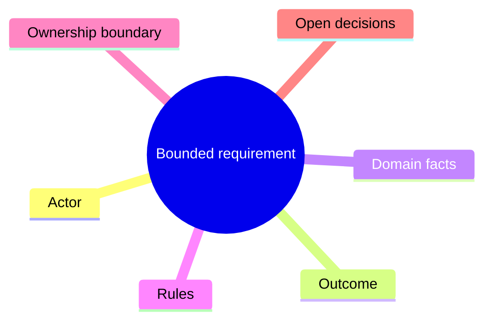
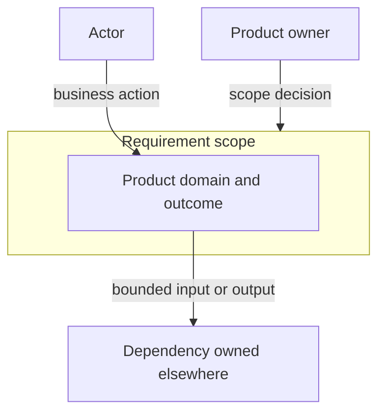
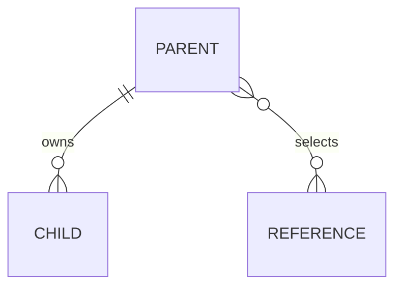
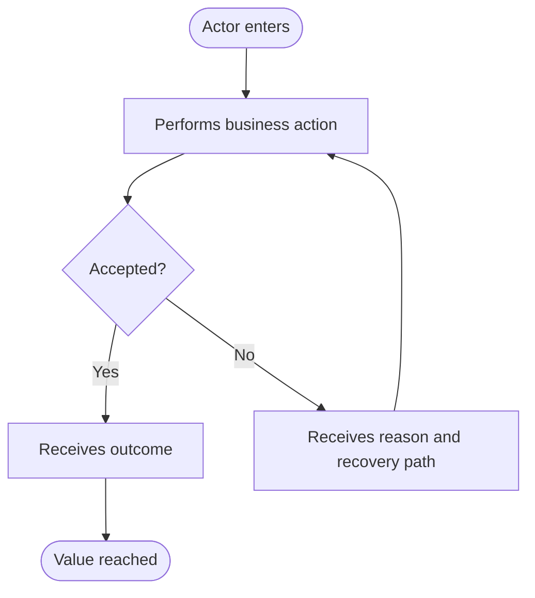

# Reader-first Requirement template

Use this template for a product Requirement or PRD that a product owner must be
able to review in one pass after explicitly selecting the
`reader-first-requirement` marker. It complements, rather than replaces, the
[PRD and TD visual documentation contract](prd-td-visual-contract.md).

## Authoring rules

- Write the primary narrative in the user's requested language. Keep stable IDs,
  code symbols, and exact contract names unchanged when they are later handoff
  inputs.
- Keep the main reading path compact: aim for two to four rendered pages before
  figures. A reviewer should reach the requested product decisions without
  reading schemas, component diagrams, runtime sequences, or test matrices.
- Use a small number of end-to-end business flows. Each flow names the trigger,
  visible outcome, rejection/recovery behavior, and acceptance it supports.
- Record dependent work as an ownership boundary, not copied requirements. A
  dependent ticket's implementation, fixture, test result, or acceptance remains
  its owner's evidence.
- State whether every core diagram is `present`, `deferred`, or `N/A`. A
  `deferred` view names its target artifact, owner, question, and entry condition.
  Do not use `N/A` when the subject exists.

---

# REQ-<id>: <user-visible outcome>

## Document control

| Field | Value |
| --- | --- |
| Document ID | `REQ-...` |
| Format profile | `reader-first-requirement` |
| Status | draft / proposed / approved / superseded |
| Owner | product owner |
| Source or revision | issue, brief, or accepted requirement revision |
| Updated | YYYY-MM-DD |
| Scope | one sentence |
| Supersedes | `N/A` or exact prior revision |

> State whether this is the authority or a local review draft. Name the current
> authority when it is not this document.

## One-page review

### Problem and outcome

- **Problem:** what is missing or harmful today?
- **Actor:** who receives value or makes the decision?
- **Outcome:** what can they observably do or learn after this work?
- **Why now:** what makes this the next bounded decision?

### Scope and non-goals

- **In scope:**
- **Not in scope:**
- **Hard constraints:** privacy, integrity, compatibility, ownership, or other
  non-negotiable rule.

### Selected direction

- **Decision:** what product direction is proposed?
- **Reason:** why is it preferable to the material alternative?
- **Boundary:** what does this Requirement hand off, and to which owner?

## Core business flows

### 1. <actor reaches the primary outcome>

Describe the trigger, the business action, visible success, and relevant
acceptance IDs.

Describe the stable rejection or recovery behavior. Do not specify a component,
schema, queue, retry algorithm, or storage mechanism here unless the product
decision itself depends on it.

### 2. <second meaningful flow>

Repeat only for a distinct user or business outcome.

### 3. <optional history, exception, or recovery flow>

Include only when it changes scope or acceptance.

## Acceptance criteria

| ID | Observable result | Owner |
| --- | --- | --- |
| `AC-001` |  | this Requirement or named dependency |
| `AC-002` |  |  |

Keep each row independently checkable. Place detailed test cases, fixtures, and
commands in the QA plan.

## Execution constraints

| ID | Product invariant or boundary constraint | Intended downstream evidence |
| --- | --- | --- |
| `FR-001` |  | Architecture / TD / QA artifact |

Use only the minimum constraints needed to stop downstream work from inventing
product behavior. Put schemas, physical storage, error enumerations, and
implementation algorithms in Architecture or TD.

## Ownership boundaries

| Topic | This Requirement owns | Owned elsewhere |
| --- | --- | --- |
| <domain or handoff> |  | ticket, service, or role |

Do not repeat another owner's requirements. State the bounded input/output
contract and name its authority.

## Decisions requested now

1. **<decision>:** the product owner accepts, rejects, or amends <direction>.
2. **<decision>:** ...

List technical questions explicitly delegated to the next artifact. A delegated
question needs a named owner and must not silently block the Requirement:

- `OPEN-001`: <question> - owner: <Architecture or TD owner>.

## Next artifacts and stop conditions

| Artifact | Question it must answer | Entry condition |
| --- | --- | --- |
| Architecture / ER / ADR |  | accepted Requirement revision |
| TD |  | accepted Architecture decision |
| QA plan |  | accepted TD contract |

State the events that require returning to the product owner, such as a changed
scope boundary, a changed dependent input contract, a privacy/integrity conflict,
or a material new user outcome.

## Visual index

Only include figures that help the product owner understand the decision. Keep
the figure source with this document and render it before review.

| ID | Type | Status | Owner / target artifact | Question and entry condition |
| --- | --- | --- | --- | --- |
| `D-01` | concept map | present | Requirement | Which product concepts must remain distinct? |
| `D-02` | system context | present | Requirement | Who owns the boundary and each handoff? |
| `D-03` | conceptual ER | present or `N/A: no persisted domain facts` | Requirement / Architecture | What entities and ownership exist at product level? |
| `D-04` | component diagram | deferred | TD | Which implementation components own the selected behavior after TD starts? |
| `D-05` | runtime sequence | deferred | TD | How does the selected implementation succeed or fail after its contracts are chosen? |
| `D-06` | lifecycle state machine | deferred | Architecture or TD | Which technical lifecycle applies after persistence and invalidation decisions are chosen? |
| `D-07` | user journey/activity | present or `N/A: no user or operator flow` | Requirement | How does the actor reach value and recover? |

### D-01 - Concept map

Question: Which product concepts must remain distinct?

Figure D-01. Product concepts only; do not add component or deployment detail.

### D-02 - System context

Question: Who owns each boundary and handoff?

Figure D-02. Context and ownership; not a component diagram.

### D-03 - Conceptual ER

Include only when domain facts are persisted or ownership cannot be understood
without relationships.

Figure D-03. Conceptual only: no physical fields, indexes, or storage choices.

### D-07 - User activity

Question: How does the actor reach value and recover from a business rejection?

Figure D-07. Business path only; runtime implementation belongs in TD.

## Review evidence and change impact

- **Source checked:** exact source/revision:
- **Figures rendered and visually inspected:** renderer/version and figure IDs:
- **Not yet performed:** Architecture, TD, QA, implementation, or external work:
- **Change impact:** which downstream artifacts must be re-reviewed if this
  Requirement changes:
