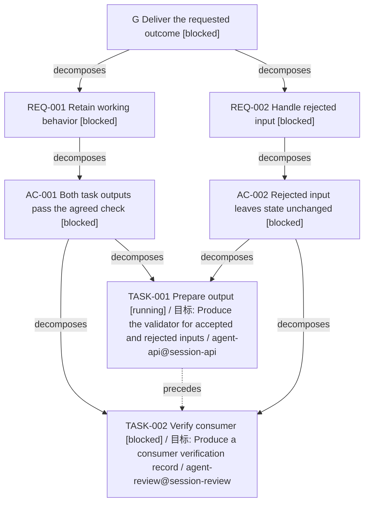

# 分配、资产和预算展示样例

本页是脚本实际输出，输入来自 tests/test_pm.py 的 managed_fixture；所有 agent/session、金额、tokens 和文件内容都是合成数据，不是当前 Codex 会话用量。查询固定在 2026-08-31T04:00:00+00:00（historical_replay=true）；fresh 只在这个时点成立，不是实时状态。

下面 DAG 由 dag 命令生成，表格由 brief 命令生成。TASK-002 的分配是 assigned，但实际工作状态是 blocked，因为 TASK-001 尚未验证完成；文件存在也不代表该分配已交付。

Goal fixture-goal: Deliver both outputs, verified against the original outcome
状态: incomplete; 来源: fresh; 时间: 2026-08-31T04:00:00+00:00
分配记录: recorded; 所有预算为来源报告，不是自动计费。

## DAG 工作目标

| TASK | 具体目标 | 完成条件 | REQ / AC | 当前分配 |
| --- | --- | --- | --- | --- |
| TASK-001 | Produce the validator for accepted and rejected inputs | Both agreed input classes have recorded results | REQ-001, REQ-002, AC-001, AC-002 | ASN-001 |
| TASK-002 | Produce a consumer verification record | Both agreed input classes have recorded results | REQ-001, REQ-002, AC-001, AC-002 | ASN-002 |

## agent / session 与资产

| 分配 / TASK | agent | session | 分配状态 | 预期资产 / 文件 / 交付记录 |
| --- | --- | --- | --- | --- |
| ASN-001 / TASK-001 | agent-api | session-api | running | A-CODE: present/current |
| ASN-002 / TASK-002 | agent-review | session-review | assigned | A-RECORD: present/unreported |

## 预算

| 分配 | 单位 | 上限 | 来源报告已用 | 当前剩余 | 状态 |
| --- | --- | --- | --- | --- | --- |
| ASN-001 | tokens | 600 | 160 | 440 | within_budget |
| ASN-001 | minutes | 10 | 2 | 8 | within_budget |
| ASN-002 | tokens | 400 | 40 | 360 | within_budget |
| ASN-002 | minutes | 10 | 1 | 9 | within_budget |
| GOAL（不与分配预算重复相加） | tokens | 1000 | 200 | 800 | recorded |
| GOAL（不与分配预算重复相加） | minutes | 20 | 3 | 17 | recorded |

未分配任务: 无
工作目标/完成条件未完整记录: 无

Goal: fixture-goal; as of 2026-08-31T04:00:00+00:00
Source: SRC-001 (fresh)

## 产品文档

| ID | 路径 | 文件状态 | REQ / TASK | owner | revision | evidence |
| --- | --- | --- | --- | --- | --- | --- |
| A-PRODUCT | /Users/jiajun.lai/.codex/worktrees/1e05/skill-creator/.runs/PM-SKILL-002/example/fixture-project/product.md | present | REQ-001, TASK-001, TASK-002 | worker | 1 | none |

## 技术文档

| ID | 路径 | 文件状态 | REQ / TASK | owner | revision | evidence |
| --- | --- | --- | --- | --- | --- | --- |
| A-CODE | /Users/jiajun.lai/.codex/worktrees/1e05/skill-creator/.runs/PM-SKILL-002/example/fixture-project/implementation.txt | present | REQ-001, TASK-001, TASK-002 | worker | 1 | none |
| A-RECORD | /Users/jiajun.lai/.codex/worktrees/1e05/skill-creator/.runs/PM-SKILL-002/example/fixture-project/evidence.txt | present | REQ-001, TASK-001, TASK-002 | worker | 1 | none |

## 需求列表

| ID | 路径 | 文件状态 | REQ / TASK | owner | revision | evidence |
| --- | --- | --- | --- | --- | --- | --- |
| A-REQ | /Users/jiajun.lai/.codex/worktrees/1e05/skill-creator/.runs/PM-SKILL-002/example/fixture-project/requirements.md | present | REQ-001, TASK-001, TASK-002 | worker | 1 | none |

## 问题列表

| ID | 路径 | 文件状态 | REQ / TASK | owner | revision | evidence |
| --- | --- | --- | --- | --- | --- | --- |
| A-ISSUE | /Users/jiajun.lai/.codex/worktrees/1e05/skill-creator/.runs/PM-SKILL-002/example/fixture-project/missing-issues.md | missing | REQ-001, TASK-001, TASK-002 | worker | 1 | none |

上述绝对路径是本次本地演练的 .runs 文件，不是可迁移安装路径；它们不进入 Git，清理运行目录后会 missing。可用 tests/test_pm.py 的 managed_fixture 在新临时目录生成同样输入；完整 JSON 台账、query 输出和 CLI 结果保留在本 worktree 的 .runs/PM-SKILL-002/example/。预算 unknown/过期/超支与移交后的观察见 [验证报告](validation.md)。
